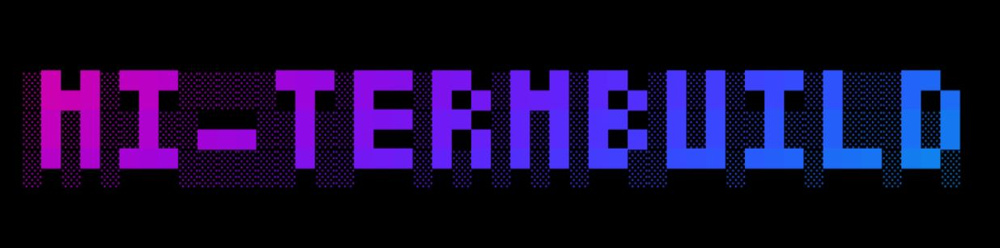
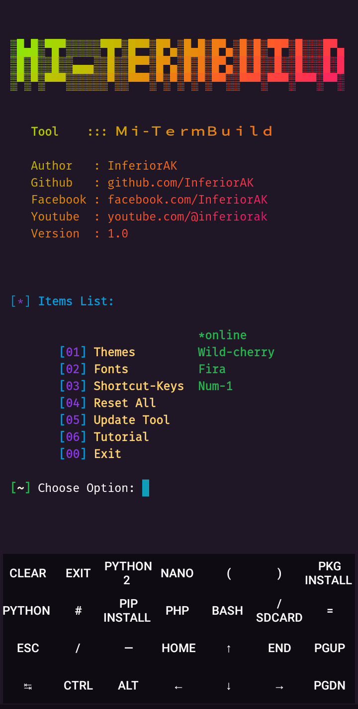

# Mi-TermBuild
<b>It's a Termux Optimized tool that can make your Termux more Precious and easier to Use</b>



<p align="center">
  
  
  
  
  
</p>
<p align="center">
  
  
  </a>
</p>
<p align=center>Tutorial : <a href="https://youtu.be/fCLCT1qx9mc" target=_blank><b>**Click**</b></a><p>

<br>

## [*] Features
<b>
+ Change Theme<br>
+ Change Fonts<br>
+ Add Extra-Keys<br>
+ Reset All Style<br>
+ Keep Updating the tool<br>
</b>
<br>

## [*] Installation and Usage
* `apt update && apt upgrade -y`
* `apt install ruby -y && gem install lolcat`
> **It's Optional. Just for stylish banner. But I will recommend you to install lolcate
* `git clone https://github.com/InferiorAK/Mi-TermBuild`
* `cd Mi-TermBuild`
* `chmod +x mi_run.sh`
* `./mi_run.sh`
> Now Enjoy! And don't forget to follow me and Subscribe my Youtube Channel

> <b>**`Note:`</b> Don't Misuse or Sell my Codes. If you want then you can learn from it but If you want to modify my Codes, Then Give me The Credits. Don't Copy it same to same with your name. <br>---Thank You---

## [*] Overview
```

 ░█▄█░▀█▀░░░░░▀█▀░█▀▀░█▀▄░█▄█░█▀▄░█░█░▀█▀░█░░░█▀▄
 ░█░█░░█░░▄▄▄░░█░░█▀▀░█▀▄░█░█░█▀▄░█░█░░█░░█░░░█░█
 ░▀░▀░▀▀▀░░░░░░▀░░▀▀▀░▀░▀░▀░▀░▀▀░░▀▀▀░▀▀▀░▀▀▀░▀▀░


    Tool    ::: Ｍｉ-ＴｅｒｍＢｕｉｌｄ

    Author   : InferiorAK
    Github   : github.com/InferiorAK
    Facebook : facebook.com/InferiorAK
    Youtube  : youtube.com/@inferiorak
    Version  : 1.0


 [*] Items List:

                            *online
        [01] Themes
        [02] Fonts
        [03] Shortcut-Keys  Num-2
        [04] Reset All
        [05] Update Tool
        [06] Tutorial
        [00] Exit

 [~] Choose Option: 
 
```

## Screenshot


## [*] Contact :
[](https://github.com/InferiorAK)
[](https://www.facebook.com/InferiorAK)
[](https://m.me/InferiorAK)
[](https://www.twitter.com/InferiorAK)
